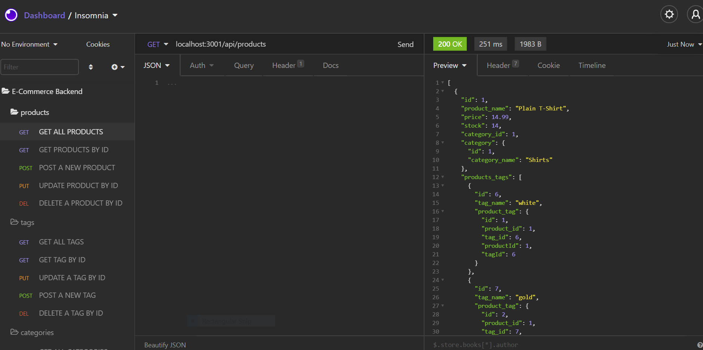
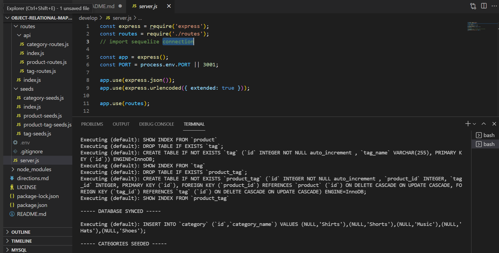

# Object-Relational-Mapping-E-Commerce-Back-End

## Assignemnt

For the thirteenth homework assignment in week thirteen of UNH Full-Stack Coding Bootcamp I was to modify starter code to configure a working Express.js API to use Sequelize to interact with a MySQL database.

## Description
```
Connect the database using Sequalize, run schema and seed commands by running node seeds/index.js to create a database with test data. Open Insomnia and use localhost:3001/api/ and type either categories, products, or tags to view the data for each and use JSON to format it in the body.

```

## Built with
```
* Javascript
* Node.js
* MySql
* Express.js
* Sequelize

```

## Installation
```

You will need to clone the respositry from Github to your local machine then open up your preferred terminal and navigate to the directory where you cloned the github repository.

You will need ro run in the terminal:

npm install, then open MYSQL workbench and exeute the schema, run node seeds/index.js on the root, then run node server.js on the root 

```

## Dependancis
```
dotenv
express
mysql2
sequalize
```

## Usage
```
Open Insomia and use localhost:3001/api/ to do a GET, POST, PUT, and DELETE
use localhost:3001/api/products to view products
    localhost:3001/apitaggs to view tags
    localhost:3001/api/categories to view categories

Sending a GET request on the path will view all in the specified path
Sending a POST request on the path will create a new item
Sending a PUT request on the path will update an existing item
Sending a DELETE request on the path will delete the item 

```


## Deployment Links
[GitHub Repository](https://github.com/efagioli01/Object-Relational-Mapping-E-Commerce-Back-End)


## VIDEO OF DEPLOYED APPLICATIONS


[](https://www.youtube.com/watch?v=ZDr9GYnt-Q0)

[](https://www.youtube.com/watch?v=LFPg1xcq0Gg)

--CLICK ON THE IMAGES TO VIEW THE VIDEO--


## Credits

UNH Full Stack Coding Book Camp partnered with Trilogy Education Services

Course Instructor - Benjamin Hutchins

Course TA - Andrew Hatfield

Tutor - Morgan Splawn


Study Group - Patrick Sullivan [Github](https://github.com/shabobble) Alan Balcom [Github](https://github.com/abalcs) Swetha Reddivari [Github](https://github.com/swethareddyl)


 ## MIT License


Permission is hereby granted, free of charge, to any person obtaining a copy
of this software and associated documentation files (the "Software"), to deal
in the Software without restriction, including without limitation the rights
to use, copy, modify, merge, publish, distribute, sublicense, and/or sell
copies of the Software, and to permit persons to whom the Software is
furnished to do so, subject to the following conditions:

The above copyright notice and this permission notice shall be included in all
copies or substantial portions of the Software.

THE SOFTWARE IS PROVIDED "AS IS", WITHOUT WARRANTY OF ANY KIND, EXPRESS OR
IMPLIED, INCLUDING BUT NOT LIMITED TO THE WARRANTIES OF MERCHANTABILITY,
FITNESS FOR A PARTICULAR PURPOSE AND NONINFRINGEMENT. IN NO EVENT SHALL THE
AUTHORS OR COPYRIGHT HOLDERS BE LIABLE FOR ANY CLAIM, DAMAGES OR OTHER
LIABILITY, WHETHER IN AN ACTION OF CONTRACT, TORT OR OTHERWISE, ARISING FROM,
OUT OF OR IN CONNECTION WITH THE SOFTWARE OR THE USE OR OTHER DEALINGS IN THE
SOFTWARE.


Copyright (c) 2021 Erica F
